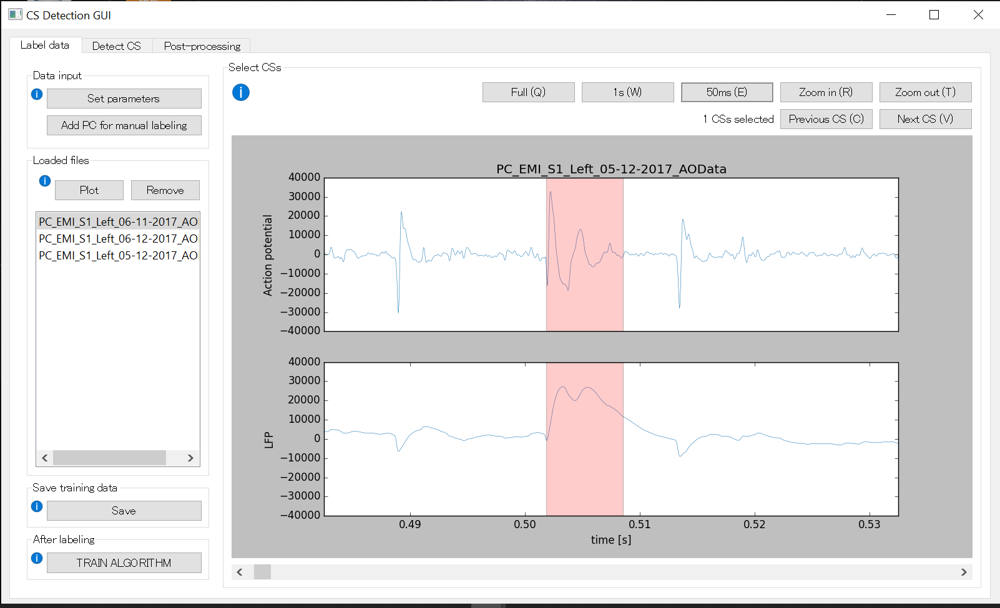
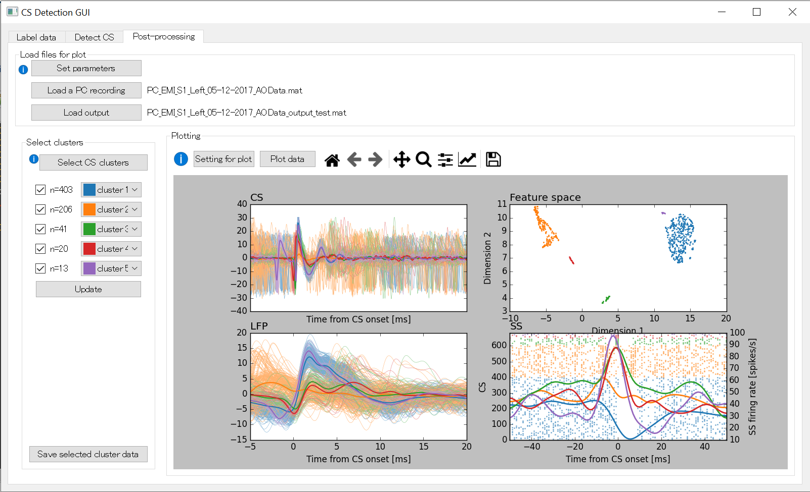

# An interactive graphical user interface for detecting cerebellar complex spikes  

- Find [our article](https://journals.physiology.org/doi/full/10.1152/jn.00754.2019?rfr_dat=cr_pub++0pubmed&url_ver=Z39.88-2003&rfr_id=ori%3Arid%3Acrossref.org) on journal of neurophysiology

- Download our GUI here
[for Windows]() and
[for Mac]().

If you want to see and modify the codes, you can clone this repository. The codes were all written in Python.

## <a name="top">How to use the GUI</a>

### [STEP 1: Labeling your data](#labeling)
### [STEP 2: Training the network](#training)
### [STEP 3: Detecting CSs](#detecting)
### [STEP 4: Post-processing](#post-processing) 
### [Trouble shoot](#trouble-shooting)

&nbsp;

## <a name="labeling">STEP1: Labeling your data</a>
This is how the GUI should look when opening it for the first time:


<a name="data-format"></a>

### 0: Data format

A file to be uploaded should contain the following variables in .mat format.
- High band-passed action potential: 1 x time
- low band-passed LFP: 1 x time    
- CS labels (optional): 1 x time 
    
    1 during CS dischage, 0 otherwise. 
    
    If you already have labeled CSs, you can also use them. But this variable is not necessary (you'll label CSs and create this variable in this section).

An example to save variables in MATLAB:
```Matlab
YourVariable = struct();
YourVariable.HIGH = HIGH;
YourVariable.RAW = RAW;
YourVariable.Labels = Labels;

save(FileName, '-struct', 'YourVariable');
```

An example to save variables in Python:
```python
import scipy.io as sp

sp.savemat(FileName, 
    {HIGH: HIGH, LFP: LFP, Labels: Labels,}, 
    do_compression=True)

# HIGH, LFP, Labels are numpy arrays
```

<a name="set-parameters"></a>
### 1: Set parameters

The first thing to do when opening the GUI is setting your parameters. Click the ***Set parameters*** button in *Data input* section in the top left corner. You can set the following parameters.

- Sampling rate [Hz]
- Action potensial variable name
- LFP variable name
- CS label variable name

CS label is optional. If you haven't labeled CSs, you can leave this empty.

Although this is not tested and therefore not recommended, in case LFP is missing, you could set the LFP variable name same as action potentian (set both "HIGH", for example). 

### 2: Upload files

After that, you click on the ***Add PC for manual labeling*** button below ***Set parameters*** button and navigate to the folder with your recordings. Select a file and press *open* to load it. 

The file that is added should be plotted instantly after loading, so you can label instantly or load more files and select on which to start. All files will be added to the list in the *loaded files* section on the left, where you can select single files to plot or remove. 

After uploading and plotting, the GUI should look like this:


### 3: Label a recording

To label CSs from your recording, you can select a CS by clicking at the onset and dragging till the offset of a CS. Selected span will be colored with red. Select CS spans as accurately as possible in order to create a good training set. You can deselect a CS span by simply clicking on the red span.

We recommend labeling ~10 CSs uniformly througuout  the recording (not only from the first few seconds, for example), so that detection can be robust to the changes of the recording states.

To change the time range of the plot, use the following function buttons (and keyboard short cut):
- **Full (Q)**: Set the time range full
- **1s (W)**: Set the time range 1 s
- **50ms (E)**: Set the time range 50 ms
- **Zoom in (R)**: Zoom in 
- **Zoom out (T)**: Zoom out

Also, you can move the time range by using the slider below the plots, or keyboard shortcut **(D)** for going backward and **(F)** for going forward.

If you want to check CSs that you have already selected, use the following function buttons (and keyboard shortcut):

- **Previous CS (C)**: Jump to the previous CS
- **Next CS (V)**: Jump to the next CS


This is an example of a selected CS:


After labeling the first recording, select another file in your list and press "plot" to plot the new recording in the GUI and proceed with labling. 

### 4: Save CSs labels from current plot

This step is not necessary, but if you want to save your CS labels of each recording separately and reuse it for a differnt training set, use **Save CS labels** button in the *Save labels of current plot* section. This will save the following variables in a .mat format, just same as the one that you upload.
- High band-passed action potential: 1 x time
- low band-passed LFP: 1 x time    
- CS labels (optional): 1 x time 
    
    1 during CS dischage, 0 otherwise. 

<a name="save-training-data"></a>
### 5: Save training data

When you finished labeling all the uploaded files, press **Save** button in the *Save training data* section.
This will not save all the time range, but automatically select only the selected CS spans and some time before and after them from each file to include non-CS spans. This is done to reduce the data size and speed up the training.

The last step is to press the **Train algorithm** button and move to the training part in your browser.

### 6: Go to Google Colab

After you save the training data, click **TRAIN ALGORITHM** button in the *After labeling* section, this will take you to a Google Colab notebook to train the network.

<div style="text-align: right">

[back to top](#top)
</div>

## <a name="training"> STEP2: Training the network</a> 

Google Colab is a free cloud computing service for Jupyter notebook offered by Google. Here you can train your network fast and easily thanks to Google's powerful computational resources.

You can run each cell by clicking the triangle on the left or <kbd>Shift</kbd>+<kbd>Enter</kbd>.

### 1: Let Google access your Google Drive

First, in order to run this notebook, you need to give Google permission to access your Google Drive.

### 2: Install the toolbox on your Google Drive

This cell installs the necessary tools on your Google Drive. This process can take a few minutes.

### 3: Upload your training data

By running this cell, you can upload the training data that you have saved in the [fist step](#save-training-data).

If you receive an error <cite>"MessageError: TypeError: google.colab._files is undefined"</cite>, check your browser's setting and allow third-party cookies.

### 4: Advanced parameter setting

You can change these paraeters only when the training does not work well. But it needs to be run for the training to work.

Max numner of iteration
- max_iter: default is 3000

The number of bins ($nb$) taken into account by the network. 
The default value was used for a sampling rate of 25 kHz. It is given by

$nb=mp^2+mp^2\cdot ks+(mp\cdot ks) - mp+2ks-2$
- ks: default is 9, needs to be odd
- mp: default is 7, needs to be odd

Check our [article](https://journals.physiology.org/doi/full/10.1152/jn.00754.2019?rfr_dat=cr_pub++0pubmed&url_ver=Z39.88-2003&rfr_id=ori%3Arid%3Acrossref.org)
for detail.

### 5: Train your network

By running this cell, you can train your network. It can take a while depending on the size of your data.


### <a name="download-weights">6: Downloading weights</a>

After your network is done with training, you can run this cell to download the weights and select your preferred folder to save them in. The weights does not have any filename extension (such as .txt, .mat). This is the last step in your browser. You can return to the GUI after completing it.

<div style="text-align: right">

[back to top](#top)
</div>

## <a name="detecting">STEP3: Detecting complex spikes</a>

After opening the GUI again, navigate to the "Detect CS" tab at the top. For detecting CSs, there are two options. One is to process a single cell ([Single file mode](#single-file-mode)), which is useful to check whether the training worked well. The other option is to process all cells in one folder at once ([Serial proess mode](#serial-process-mode)). You can use this option once you are sure that the training was successful.

This is the detection tab of the GUI when re-entering:


### <a name="data-format2">0: Data format</a>

A file to be uploaded is similar to [STEP 1](#data-format) and should contain the following variables in .mat format.
- High band-passed action potential: 1 x time
- low band-passed LFP: 1 x time    
- SS train (optional): 1 x time 
    
    1 at the onsets of SS, 0 otherwise. This is not used in the detection process, but useful later for [post-processing](#post-processing).
    **The sampling rate of SS train can be different from the other two variables** (default is 1000 Hz). SS train is not available, leave the variable name empty.  

### <a name="set-parameters2">1: Set sampling rate and variable names</a>

Just like in [STEP 1](#set-parameters), click **Set parameters** button to set the sampling rate and variable names to be loaded. 

<a name="single-file-mode"></a>
### ---Single file mode---

### 1: Uploade a file

In the *Single file* section, click **Upload a PC recording** button to upload your file containing the [abovementioned variables](#data-format2).

### 2: Upload weights

To upload weights that you have downloaded from [Google Colab](#download-weights), click **Upload your downloaded weights from Colab** button.

### <a name="detect-cs">3: Detect CSs</a>

After uploading your recording and weights, click **Detct CS** button to start detecting CSs. This process can take a while depending on the length of the recording and the computational power of your computer.

When CSs are detected, it will show the number of detected CSs and yon can save the output file. The file contains the following variables:
- CS_onset:  Times of CS start (1 x # of CSs)
- CS_offset: Times of CS end (1 x # of CSs)
- cluster_ID: Cluster ID for each CS (1 x # of CSs)
- embedding: Two dimensional representation of CS feature space (# of CSs x 2)

<a name="serial-process-mode"></a>
### ---Serial process mode---

### 1: Select a folder

You need to select a folder in which you saved your recordings. This folder should only contain files of the [same data format](#data-format2). 

### 2: Select a folder to save output

In Serial process mode, it makes an output file per each recording file. Therefore, you need to designate a folder for the output files. To do this, click **Select folder to save output** button.

### 3: Upload weights

Same as [Single file mode](#single-file-mode), click **Upload your downloaded weights from Colab** button to upload weights that you have downloaded from [Google Colab](#download-weights).

### 4: Set output and log file names

After the processing, you'll find two types of files in the output folder: output files and a log file.

- Output file name: *file name of the PC* + *_output.mat* by default
- Log file name: *log.csv* by default.

The log file is a .cvs format and consists of file name, number of detected CSs, number of clusters and the sizes of each cluster.

### 5: Detect CSs

After uploading your recording and weights, click **Detct CS** button to start detecting CSs. Then it will check the files of your recordings if the format is correct and tells you how many files will be inspected. Check the files that did not match the format by cancelling it and if you are fine with it, click **Proceed** button. This process can take a while depending on the length and the number of the recordings and the computational power of your computer.

<div style="text-align: right">

[back to top](#top)
</div>

## <a name="post-processing">STEP4: Post-processing</a>


The final step is to check the quality of CSs detected by the algorithm. The detected CSs are grouped by several clusters and you can select to save or discard each cluster of CSs.

If CSs were successfully detected and follow the steps below, the third tab should in the end look like this:



### 0: Data format

For the post-processing, you need two files:
a [file of PC recording](#data-format2) and an [output file](#detect-cs) from [STEP3](#data-format2). If you just finished this step, the last files that you proceeded are automatically loaded here. Otherwise, you can also upload other files as you want.


### 1: Set sampling rate and variable names

Just like in [STEP 1](#set-parameters) and [STEP2](#set-parameters2), click **Set parameters** button to set the sampling rate and variable names to be loaded. 

### 2: Upload files

Click **Load a PC recording** and **Load output** button to load a [file of PC recording](#data-format2) and [output file](#detect-cs).

### 3: plot data

Once you have uploaded your files, you can plot the data by clicking **Plot data** button in the *Plotting* section. You should see 4 plots. 

- CS (top left): High-passed action potential aligned to CS onset.
- LFP (bottom left): LFP aligned to CS onset.
- Feature space (top right): Dimensionally reduced feature space by UMAP. This was used to cluster CSs.
- SS (bottom right): SS raster and mean firing rates aligned to CS onset. **If SS train variable is not available, this will not be plotted**.

You can also change the following parameters for plotting by clicking **Setting for plot**. 
- SS sampling rate: Sampling rate of the variable SS train.
- Time range from CS & LFP: Time before and after CS onset in ms. 
- Marker size for feature space: Size of markers (dots) for the feature space plot.
- SS raster sorted by: You can sort the SS either by the order of 
- Gaussian kernel size: Mean firing rates of SSs are computed after convolving it with a Gaussian kernel. You can change the size of the kernel.
- Marker size for SS raster: Size of markers (dots) for the SS raster plot.
- Time range for SS raster: Time before and after CS onset in ms for SS raster and mean firing rates.

### 4: Select CS clusters

After plotting, you can select which CS clusters to save, based on shapes of CS/LFP, distance between clusters in feature space and pause of SS firing after CS.

First, click **Select CS cluster** button in the *Select clusters* section. Then you can see checkboxes, size of clusters and cluster ID with different colors. By default, all clusters will be saved. If some of the clusters are not CSs, uncheck the checkbox and click **Update** button. This button updates the plots on the right. 

If you click the colored squares on the right of the checkbox, you can change the color(cluster IDs) and merge different clusters.

### 5: Save CS clusters

After updating the CS clusters by clicking **Update** button, you can save CS clusters that you have selected. The saved format is the same as the [output file](#detect-cs)

<div style="text-align: right">

[back to top](#top)
</div>

## <a name="trouble-shooting">Trouble shooting</a>

In case this GUI crashes, there several things that you can check and try.

First of all, check again the formats and variable names of your files. Unexpected formats may cause error.

In order to see what kind of errors are returened, you can run from a command prompt (on Windows) or terminal (on Mac). 

Also, if the data is too big, you can try deviding the recordings into small parts to reduce the data size. 

<div style="text-align: right">

[back to top](#top)
</div>